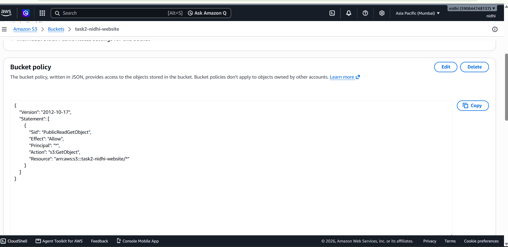
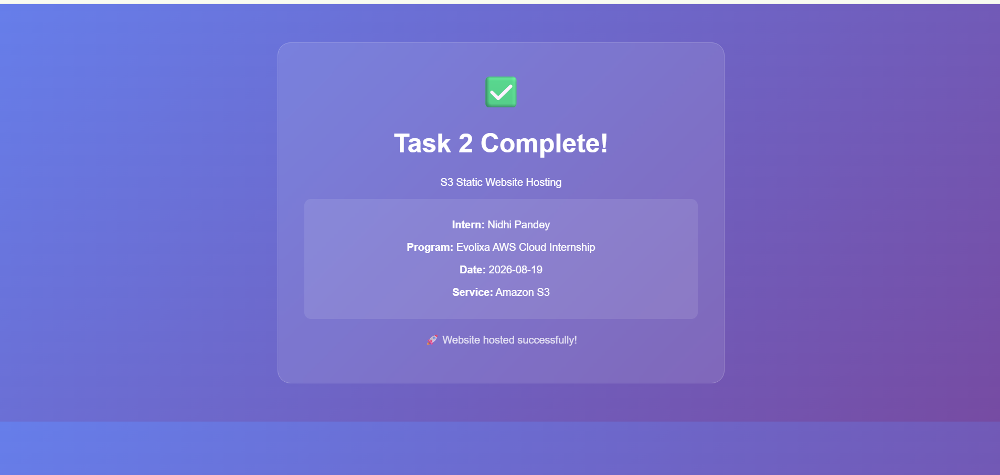
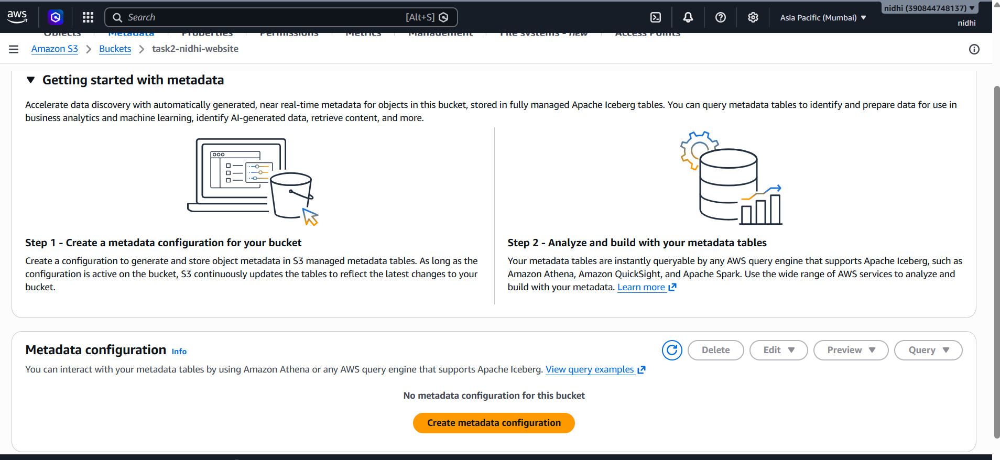
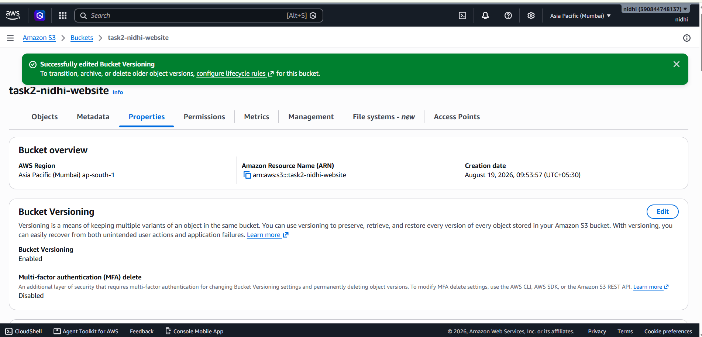
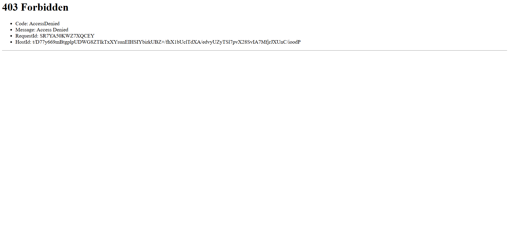
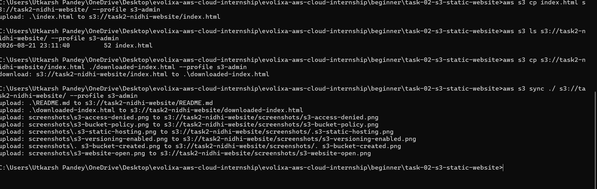

# Task 2: S3 Static Website Hosting

## 🎯 Objective
Host a static website using S3 bucket and explore storage/backup workflow.

## 🛠️ Services Used
- Amazon S3
- Static Website Hosting
- S3 Versioning
- AWS CLI

## 📝 Steps Performed

### 1. S3 Bucket Created
- Bucket Name: `task2-nidhi-website`
- Region: `ap-south-1` (Mumbai)
- Public Access: Enabled for static hosting

### 2. Static Website Hosting Enabled
- Static website hosting: Enabled
- Index document: `index.html`
- Endpoint URL generated

### 3. Bucket Policy Added
- Added policy for public read access
- Allowed `s3:GetObject` for all users

### 4. Uploaded `index.html` File
- Uploaded sample HTML file to the bucket

### 5. Website Tested
- Accessed via S3 endpoint URL
- Website loaded successfully

### 6. Explored Object Metadata
- Viewed metadata using S3 console
- Checked Content-Type, Content-Length, Last-Modified

### 7. Enabled Versioning
- Enabled bucket versioning for data protection
- Tested by uploading multiple versions of a file

### 8. Tested Access Without Public
- Temporarily blocked public access
- Website showed "Access Denied" error
- Re-enabled public access after testing

### 9. Used AWS CLI for S3 Operations
- Used `aws s3 ls` to list buckets
- Used `aws s3 cp` to upload/download files
- Used `aws s3 sync` to sync local directory with S3

## 🔗 Website URL
[http://task2-nidhi-website.s3-website.ap-south-1.amazonaws.com](http://task2-nidhi-website.s3-website.ap-south-1.amazonaws.com)

## 📸 Screenshots

### 1. S3 Bucket Created

### 2. Static Hosting Enabled

### 3. Bucket Policy Added

### 4. Website Open in Browser

### 5. Updated Website (Version 2.0)

### 6. Object Metadata

### 7. Versioning Enabled

### 8. Access Denied Test

### 9. AWS CLI Commands

## 💡 Key Learnings
- S3 can host static websites
- Bucket policies control access
- Versioning protects against accidental deletion
- Public access should be carefully managed
- AWS CLI automates S3 operations

## ✅ Results
- ✅ S3 bucket created successfully
- ✅ Static website hosting enabled
- ✅ Website accessible via browser
- ✅ Versioning enabled
- ✅ Metadata explored
- ✅ AWS CLI commands tested

## 📅 Completion Date
2026-08-19

## 👩‍💻 Intern
Nidhi Pandey

## 📄 Documentation / Report
https://1drv.ms/w/c/859E8085443986A6/IQAJ02QPGEyiTYGqolQTTWdpAaFqZ31WLqe742mBsJfQh40?e=VbdXHk
